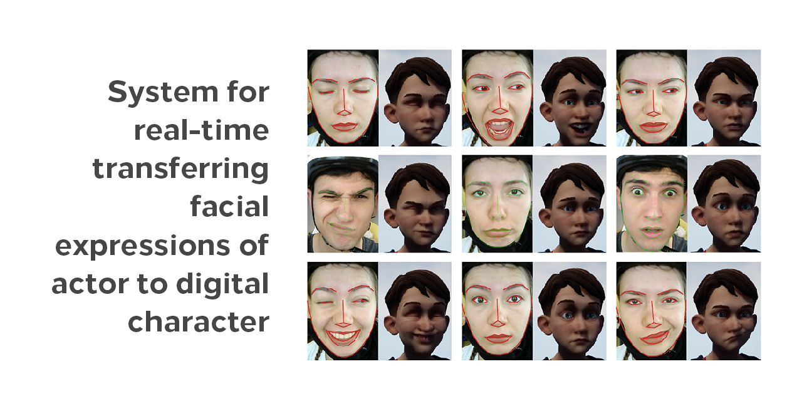
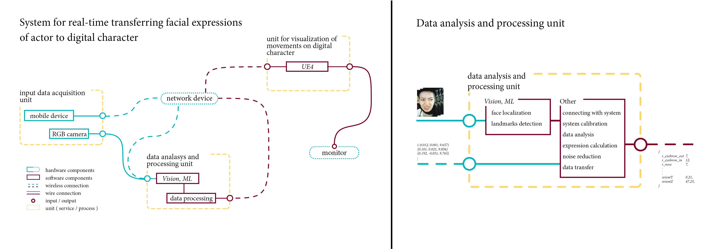

# Data-Analysis-and-Processing-Unit

## Video

The link of the video shows a short demo of results.

https://www.youtube.com/watch?v=s5cxJsi77JA

## Description

The project was done as part of my B.Sc. thesis. 

Data analysis and processing unit is a computer station with appropriate software support, which is part of the system (shown in the figure below) for real-time transferring facial expressions of actor to digital character. 

The purpose of this unit is to analyse input data, as well as processing those data in real time, and for output data gives extracted prepared useful data ready for use from visualization of facial expressions unit (https://github.com/acoMCMXCVI/Unit-for-Visualization-of-Expressions-UE4).

The input data of this unit is consisted of sequence of the obtained images from RGB camera for facial expressions estimation, and sequence of vectors obtained from accelerometer for head pose estimation.

## _Assets_

The character that was used is a part of "A boy and his kite" demo which can be found in Unreal store:
https://www.unrealengine.com/marketplace/en-US/store

## Usage

In order of successfully implementation of the system, it is necessary to install all parts of the system. 
For all details, feel free to contact me by e-mail: rajicaleksandar6@gmail.com.
